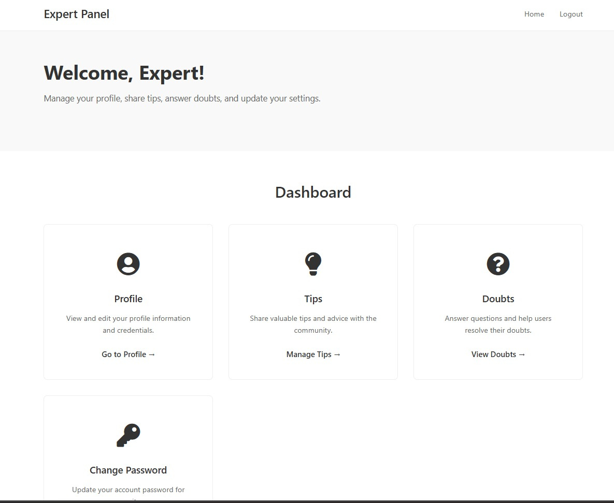
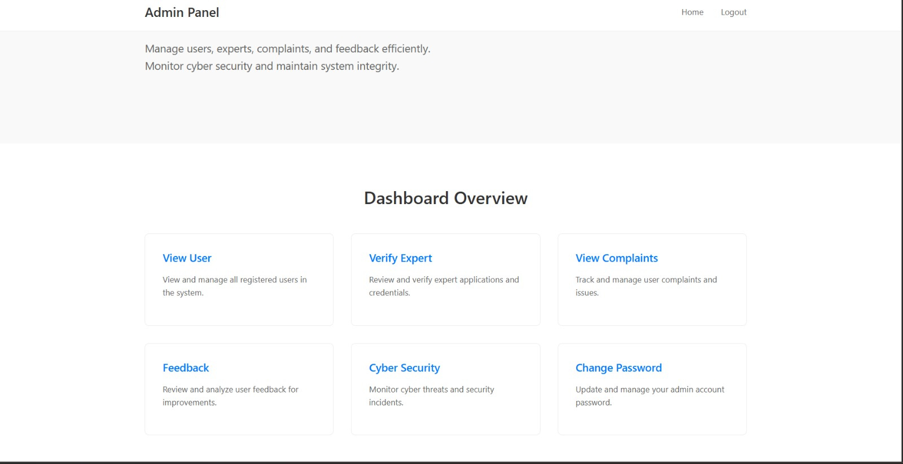

# OSN Identity Theft Detection


## Overview


OSN Identity Theft Detection is a web-based Online Social Network platform designed to provide social networking features together with identity protection and user safety mechanisms.


The project combines a Django-based web application with a Flutter frontend and computer vision techniques to help protect users from unauthorized use of their facial images on the platform.


---


## Key Features


### Identity Protection


* Face detection using OpenCV

* Face recognition using the `face_recognition` library

* Comparison of detected faces with registered users

* Automatic blurring of faces that are not authorized

* User notification when an unidentified face is detected

* Accept/reject workflow for detected faces

* Reprocessing of images after user decisions


### Social Networking


* User registration and login

* User profiles

* Create and view posts

* Like posts

* Comments and replies

* Friend requests

* Friend-based post visibility

* Private chat

* Notifications

* User search


### Safety and Moderation


* Keyword-based bullying comment detection

* Comments classified as `Bullying` or `Normal`

* Complaint submission

* Expert support

* Safety tips

* User doubts/questions


### Expert Module


The expert module provides functionality for handling user complaints, doubts, and safety-related interactions.


### Admin Module


The admin module provides administrative functionality for managing and monitoring the platform.


---


## Identity Protection Workflow


```text

User uploads an image

&#x20;       |

&#x20;       v

Face Detection using OpenCV

&#x20;       |

&#x20;       v

Detected faces are extracted

&#x20;       |

&#x20;       v

Face Recognition

&#x20;       |

&#x20;       v

Compare with registered users

&#x20;       |

&#x20;       +----------------------+

&#x20;       |                      |

&#x20;  Recognized/Allowed      Not Recognized

&#x20;       |                      |

&#x20;       |                      v

&#x20;       |                Face is blurred

&#x20;       |                      |

&#x20;       |                      v

&#x20;       |                User is notified

&#x20;       |                      |

&#x20;       |                      v

&#x20;       |                Accept / Reject

&#x20;       |                      |

&#x20;       +----------+-----------+

&#x20;                  |

&#x20;                  v

&#x20;             Final Image

```


---


## Face Recognition


The project uses the `face_recognition` Python library to identify whether a detected face matches a registered user's stored facial encoding.


The recognition process includes:


1. Detecting faces in an uploaded image.

2. Generating facial encodings.

3. Comparing the detected encoding with registered user encodings.

4. Determining whether the face matches an existing registered user.

5. Applying the appropriate identity-protection action.


The project uses the library's existing face-recognition models and does not train a custom face-recognition model.


---


## Face Blurring


When an image contains a face that is not authorized or recognized, the system can blur that face before displaying the post.


This helps reduce unauthorized exposure of people's faces while still allowing the user to share the image.


The system can also reprocess an image after a user accepts or rejects a detected face through the notification workflow.


---


## Bullying Comment Detection


The platform includes a keyword-based comment moderation mechanism.


Comments are checked against a predefined keyword list stored in:


```text

bullying_keywords.csv

```


The system uses whole-word matching to identify potentially harmful or bullying terms.


Comments are categorized as:


```text

Bullying

Normal

```


This implementation is currently **rule-based keyword detection**, rather than a trained NLP classification model.


---


## Technologies Used


| Technology         | Purpose                                   |

| ------------------ | ----------------------------------------- |

| Python             | Backend development and application logic |

| Django             | Web application framework                 |

| Flutter            | Frontend/mobile application               |

| Dart               | Flutter application development           |

| MySQL              | Database                                  |

| OpenCV             | Face detection and image processing       |

| face_recognition   | Facial encoding and face comparison       |

| NumPy              | Numerical and image-processing operations |

| Pandas             | Data processing                           |

| Pillow             | Image processing                          |

| TensorFlow / Keras | Additional machine-learning components    |

| scikit-learn       | Machine-learning utilities                |

| SMTP               | Email notifications                       |

| python-dotenv      | Environment variable management           |

| Git                | Version control                           |

| GitHub             | Source-code hosting                       |


---


## Screenshots


### Frontend


#### Login


#### Registration


#### Home


#### Profile


---


### Expert Module





---


### Admin Module





---


## Project Structure


```text

osn-identity-theft-detection/

│

├── flutter_app/

│   └── Flutter frontend

│

├── myapp/

│   ├── models.py

│   ├── views.py

│   ├── urls.py

│   ├── recognize_face.py

│   ├── predict_fn.py

│   └── ...

│

├── osm/

│   └── Django project configuration

│

├── templates/

│   └── HTML templates

│

├── static/

│   └── Static files

│

├── screenshots/

│   ├── frontend/

│   │   ├── home.png

│   │   ├── login.png

│   │   ├── profile.png

│   │   └── register.png

│   │

│   ├── expert/

│   │   └── expert.png

│   │

│   └── admin/

│       └── admin.png

│

├── bullying_keywords.csv

├── manage.py

├── requirements.txt

└── README.md

```


---


## Main Database Entities


The application contains database models for different parts of the social networking and safety system, including:


* Users

* Posts

* Comments

* Comment replies

* Likes

* Friend requests

* Notifications

* Private chats

* Complaints

* Feedback

* Experts

* Doubts

* Safety tips


---


## How the Identity Protection System Works


### 1. Image Upload


A user uploads an image while creating a post.


### 2. Face Detection


OpenCV is used to detect faces present in the uploaded image.


### 3. Face Recognition


Detected faces are processed using facial encodings and compared with registered user encodings.


### 4. Identity Check


The system determines whether a detected face matches an existing registered user.


### 5. Face Protection


Faces that are not authorized can be blurred before the image is displayed.


### 6. Notification


The relevant user can receive a notification regarding the detected face.


### 7. User Decision


The user can respond through the available accept/reject workflow.


### 8. Image Reprocessing


The image can be processed again according to the user's decision.


---


## Installation


### 1. Clone the Repository


```bash

git clone <repository-url>

cd osn-identity-theft-detection

```


### 2. Create a Virtual Environment


```bash

python -m venv venv

```


Activate it on Windows:


```powershell

venv\Scripts\activate

```


### 3. Install Dependencies


```bash

pip install -r requirements.txt

```


### 4. Configure Environment Variables


Create a `.env` file and configure the required values such as:


```text

DJANGO_SECRET_KEY=your_secret_key

DB_NAME=your_database_name

DB_USER=your_database_user

DB_PASSWORD=your_database_password

DB_HOST=your_database_host

DB_PORT=your_database_port

EMAIL_HOST_USER=your_email

EMAIL_HOST_PASSWORD=your_email_password

```


Do not commit real credentials or passwords to GitHub.


### 5. Configure MySQL


Create the required MySQL database and update the Django database configuration according to your local environment.


### 6. Run Migrations


```bash

python manage.py makemigrations

python manage.py migrate

```


### 7. Start the Development Server


```bash

python manage.py runserver

```


The Django development server will then be available locally.


---


## Security and Privacy Considerations


The project is designed with user safety and identity protection in mind.


Important considerations include:


* Sensitive credentials should be stored in environment variables.

* Database passwords should never be committed to GitHub.

* Facial data should be handled carefully.

* User-uploaded images should be protected from unauthorized access.

* Production deployments should use appropriate authentication and authorization controls.

* Development settings such as `DEBUG=True` should not be used in production.

* Hard-coded local file paths should be replaced with configurable application paths before deployment.


---


## Current Implementation Notes


* Face recognition uses the `face_recognition` library and its existing models.

* The project does not train a custom face-recognition model.

* Bullying detection currently uses keyword-based rule matching.

* The project contains additional TensorFlow/Keras image-model code, but the corresponding prediction call is not part of the active post-upload identity-protection workflow.

* Some development-specific file paths may need to be configured for a different machine or production environment.

* The current configuration is primarily intended for development and project demonstration.


---


## Future Improvements


Possible future improvements include:


* Improve face-recognition accuracy and robustness.

* Add stronger privacy controls for facial data.

* Replace hard-coded paths with configurable media paths.

* Improve bullying detection using NLP and machine-learning techniques.

* Add more advanced content moderation.

* Improve authentication and authorization.

* Add automated testing.

* Improve deployment configuration.

* Add production-ready logging and monitoring.

* Deploy the application using a production web server and secure infrastructure.


---


## Project Purpose


The main purpose of this project is to combine social networking functionality with identity protection and user-safety mechanisms.


The project explores how computer vision, web development, database systems, and moderation techniques can be integrated into a social networking platform to provide additional protection for users and their uploaded content.


---


## Author


**Amaljith K**


BSc Computer Science

Python | Django | Machine Learning | Computer Vision


---


## License


This project was developed for educational and portfolio purposes.


